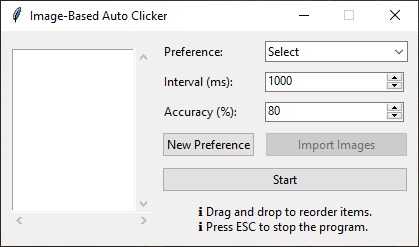

# Image-Based Auto Clicker

## Description

This project is a simple application that performs auto-clicking based on image recognition. It aims to provide a seamless experience for users to achieve their goals while idling.

## Features

- Image recognition-based clicking
- Adjustable interval
- Lightweight and easy to use

## How it works

1. Add a new preference, then select it from the dropdown.
2. Import the target image.
3. Adjust the settings.
4. Reorder the images (hold and drag the image vertically).
5. Press **Start** and let it run.
6. The target image will be clicked automatically.

## Image

## Contribution

The app is developed in Python using Tkinter. Any developer with decent Python skills can contribute. Feel free to fork the repo and submit pull requests.
